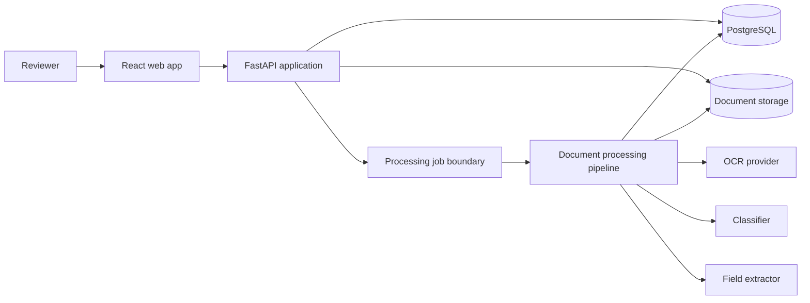
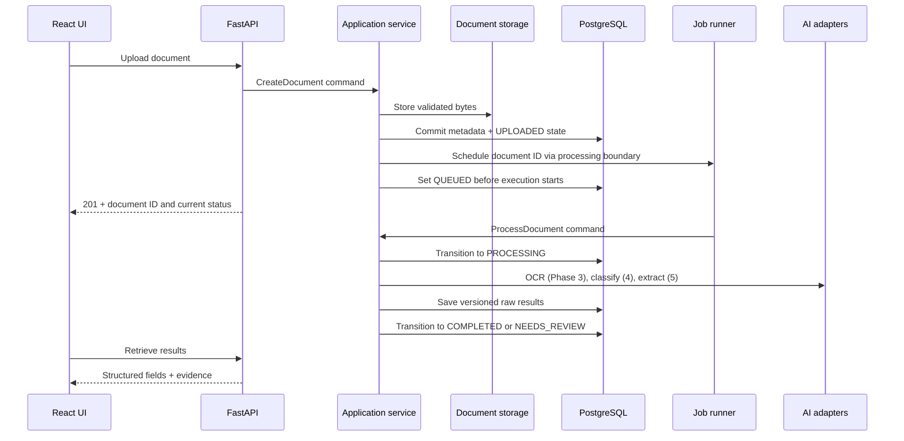

# Architecture

## 1. Architectural goals

DocuMind AI uses a modular monolith with ports and adapters. This is simpler for one developer than microservices, while preserving boundaries that allow OCR, classification, extraction, storage, and job execution to change independently.

The central rule is dependency direction: domain and application code know interfaces and normalized data structures, not PaddleOCR, OpenCV, FastAPI, SQLAlchemy, or a particular job queue.

## 2. System context



This diagram shows the target architecture across phases, not the Phase 1 file structure. Phase 1 implements validated upload, persistence, and retrieval only, with no job dispatcher or placeholder job interfaces/classes. Phase 3 introduces the processing/job boundary alongside OCR; classification and extraction follow in Phases 4 and 5. Processing may run synchronously when measured performance is reasonable or use a simple in-process background runner. Keep the processing use case callable by a future worker without adding external queue infrastructure now.

## 3. Backend layers

| Layer | Responsibility | May depend on |
|---|---|---|
| `api` | HTTP parsing, schemas, status codes, dependency wiring | application, domain DTOs |
| `application` | use cases, transactions, workflow/state orchestration | domain ports/models |
| `domain` | entities, value objects, state rules, provider/repository contracts | Python standard library and lightweight typing only |
| `infrastructure` | PostgreSQL repositories, file storage, PDF/image tools, AI implementations, job runner | domain/application ports plus external libraries |
| `core` | centralized configuration and shared application setup | settings libraries; no AI/business logic |

No API route imports PaddleOCR, OpenCV, scikit-learn, or PyTorch. No application service constructs a concrete provider.

## 4. Replaceable ports

The exact Python signatures will be finalized in the phase that uses them. Phase 1 introduces only document storage and document repository contracts. OCR and processing/job contracts begin in Phase 3, classification in Phase 4, extraction in Phase 5, and review in Phase 6. Do not create empty abstractions in advance. The target conceptual contracts are:

```text
DocumentStorage
  put(stream, detected_media_type) -> StoredObject
  open(storage_key) -> binary stream
  delete(storage_key)

OCRProvider
  recognize(pages, context) -> OCRResult

DocumentClassifier
  predict(ocr_result, context) -> ClassificationResult

FieldExtractor
  extract(document_type, ocr_result, context) -> ExtractionResult

ProcessingJobDispatcher
  enqueue(document_id) -> job_id

DocumentRepository / ResultRepository / ReviewRepository
  persistence operations expressed in domain terms
```

Provider selection uses simple Python dependency wiring based on configuration, with no plugin system or unnecessary factories. Tests inject deterministic fakes. Future provider replacements can implement the same normalized contract, subject to project architectural guidelines.

## 5. Processing flow

Phase 1 validates and stores the upload, commits its metadata in `UPLOADED` state, and returns HTTP 201 with the document ID and status. Get/list endpoints retrieve that metadata; no processing or job infrastructure is involved.

The following shows a successful flow with automatic background processing enabled from Phase 3 onward. Classification and extraction steps apply only after their respective phases. Document creation succeeds before scheduling processing; a scheduling failure must not erase the uploaded document and must allow a later retry. When automatic processing is disabled, upload stops after document creation and its response.



Processing stages are independently testable. Each stage consumes and produces normalized results and records timing, provider, model/config version, and errors. Retries should be idempotent for a `(document_id, pipeline_version)` pair.

Canonical document states are `UPLOADED`, `QUEUED`, `PROCESSING`, `NEEDS_REVIEW`, `COMPLETED`, and `FAILED`. Phase 1 only needs `UPLOADED`. From Phase 3, centralized domain transition rules cover scheduled processing (`UPLOADED` → `QUEUED` → `PROCESSING`), direct synchronous processing (`UPLOADED` → `PROCESSING`), successful completion (`COMPLETED` or `NEEDS_REVIEW`), and processing failure (`FAILED`). Retry/reprocess transitions reuse these states; Phase 6 review can move `NEEDS_REVIEW` to `COMPLETED`. API/frontend code must not invent additional status values.

`POST /api/v1/documents/{document_id}/process` is mainly a manual retry/reprocess/development endpoint. Normal users upload once and see status/results; automatic scheduling may be enabled from Phase 3. A synchronous MVP implementation uses the same processing use case and must be justified by measured performance.

## 6. Core domain model

| Concept | Key information |
|---|---|
| Document | ID, metadata, checksum, storage key, lifecycle state, timestamps, revision |
| Page | document ID, page number, dimensions, rendered storage key |
| OCR result | provider/version, page text, ordered tokens/lines, confidence, geometry |
| Classification | predicted type, score map, threshold, model/version, raw/reviewed status |
| Extracted field | schema key, value, evidence text, page, one or more boxes, confidence, extractor/version |
| Processing run | pipeline version, stage status/timings, attempt, error category |
| Review | document revision, reviewer identifier, changes, timestamps, completion state |
| Evaluation run | dataset/model/config versions, metrics, timestamp, artifact references |

Raw predictions are immutable. Reviewed/current values are a separate projection based on correction events. This makes evaluation against machine output honest and retains an audit trail.

Phase 5's initial contract schema is limited to contract number, title, party A, party B, effective date, expiry/termination date, contract value, and governing law. Use source-backed extraction and explicit missing values; LLM summarization is outside Phase 5. Any future contract summarization would belong to a later optional LLM/RAG extension, not the current extraction scope.

## 7. Geometry and confidence contracts

At domain and API boundaries, a bounding box is `{x, y, width, height}` in page-relative coordinates from 0 to 1, with origin at the top-left. Page number is one-based. If an OCR engine emits polygons, the adapter retains raw output and also creates the normalized enclosing box; polygon support can be added without changing existing consumers.

Every confidence value is a float from 0 to 1 with a source and provider/model version. OCR confidence, classifier probability, extraction heuristic confidence, and calibrated confidence have different meanings. The UI labels the source, and thresholds are configuration/version data rather than unexplained constants.

## 8. Persistence strategy

- PostgreSQL stores relational metadata, states, reviews, model versions, and searchable result summaries.
- JSONB is acceptable for versioned OCR tokens and evolving extractor payloads initially; frequently queried fields can be normalized later.
- Original uploads and rendered pages live behind `DocumentStorage`, using local disk for development and an object-store adapter later.
- Database rows store opaque storage keys, never trusted filenames.
- Migrations are the source of truth for schema changes.
- A database transaction cannot atomically commit a filesystem write. Creation therefore stores to a temporary/opaque object, commits metadata, and cleans abandoned objects through explicit error handling; this tradeoff is tested.

## 9. API shape

Document endpoints are versioned under `/api/v1`. Phase 1 includes:

```text
POST   /api/v1/documents
GET    /api/v1/documents
GET    /api/v1/documents/{document_id}
GET    /health
```

`GET /health` returns HTTP 200 with `{"status": "ok"}` for a running application; it does not check dependency readiness. Later resources are introduced only in their owning phases:

```text
# Phase 3
GET    /api/v1/documents/{document_id}/results
POST   /api/v1/documents/{document_id}/process
# Phase 6
PUT    /api/v1/documents/{document_id}/review
# Phase 8 operational improvements
GET    /health/live
GET    /health/ready
```

Uploads create a document and return its ID and status. Phase 1 error responses include a stable code, human-readable message, and optional safe details; correlation IDs are added in Phase 8. From Phase 6, review updates include the expected document revision for optimistic concurrency control.

## 10. Frontend structure

- `features/documents`: upload, list, status, and API queries
- `features/review`: page viewer, field editor, evidence overlay, and review submission
- `components`: reusable accessible UI primitives
- `lib/api`: manually maintained API client/types aligned with backend contracts during the MVP; generation is deferred until contracts stabilize
- `routes`: page-level composition

The document viewer maps normalized boxes to the displayed page size, so backend geometry does not depend on browser dimensions.

## 11. Security and operational design

- Stream uploads and enforce byte/page/pixel limits.
- Detect file signatures and parse using constrained, patched libraries; client MIME is advisory only.
- Generate storage keys server-side and keep stored files outside public static paths.
- Redact content and sensitive fields from logs.
- Phase 8 adds request/correlation IDs, structured logs, and advanced stage-level observability.
- Phase 1 uses only `/health`. Phase 8 adds `/health/live` for process health and `/health/ready` for required dependencies.
- Authentication is deferred for the student MVP, but API dependencies reserve a current-user/reviewer boundary.

Record measured API/upload/metadata latency, OCR time per page, total processing time, and document list latency as those features exist. Document hardware, workload, versions, sample counts, and measurement conditions; Phase 8 consolidates the benchmark report. No latency number is a hard acceptance criterion before measurement establishes a baseline.

## 12. Testing strategy

- Domain unit tests: state transitions, confidence/geometry validation, review merging.
- Application unit tests: Phase 1 uses fake repositories/storage; jobs and AI test doubles start only when their components are introduced.
- Adapter tests: OCR normalization, local storage, classifier/extractor behavior.
- API integration tests: status codes, schemas, validation, and database transactions.
- Frontend checks: lint, type-aware production build, component tests for complex review behavior.
- End-to-end tests: upload through review using tiny synthetic fixtures and deterministic fake AI.
- Evaluation tests: metric calculations on hand-checkable examples; full model benchmarks run separately.

Tests that do not explicitly exercise AI adapters must not download models, use a GPU, or require network access.

## 13. Deployment evolution

1. Local backend with local storage and PostgreSQL.
2. React frontend and backend run separately in development.
3. Docker Compose packages frontend, API, worker/job runner if present, and PostgreSQL.
4. Optional production evolution: object storage, external queue, multiple workers, authentication, and monitoring.

The modular monolith remains valid through step 3; microservices are not a project goal.
